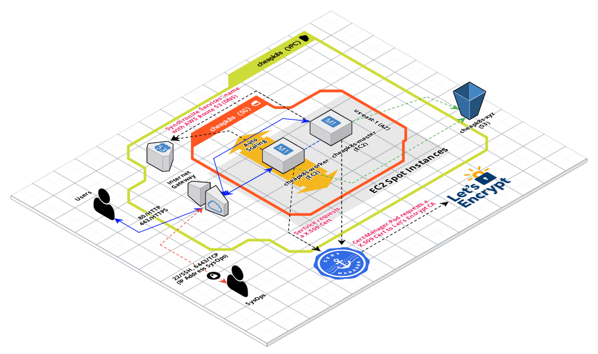

Terraform scripts to create an affordable Kubernetes Cluster hosted in affordable Public Cloud (~7 euros/month).
The Kubernetes Cluster will be built on top of cheaper resources or something like [AWS Spot Instances](https://aws.amazon.com/ec2/spot) or [Google Cloud Preemptible VM Instances](https://cloud.google.com/preemptible-vms).

These Terraform scripts are based in the `0.2.1-chilcano` branch of [forked GitHub repo](https://github.com/chilcano/kubeadm-aws). 

## Creating Kubernetes Cluster

### AWS samples

**1) Simple K8s Cluster (1 Master, 1 Worker)**

...

**2) K8s Cluster (1 Master, 1 Worker) with Ingress and Router 53 custom DNS**

....

### Google samples

...

## ToDo

**References:**

- aws-terraform-kubeAdm
  * [https://github.com/graykode/aws-kubeadm-terraform](https://github.com/graykode/aws-kubeadm-terraform)
- terraform-provider-kubeadm
  * [https://github.com/inercia/terraform-provider-kubeadm](https://github.com/inercia/terraform-provider-kubeadm)
